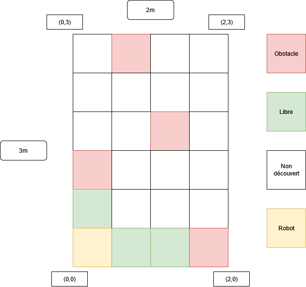

### Annexes

# Sujet : Jeu pokémon. 
  Visualisation via une interface WEB  du plateau virtualisé sur lequel se déplcace le robot. Chaque obstacle fixe rencontrer par le robot équivaudra sur l'interface virtuel à un ennemi à combattre ou à fuir. 

# Etape 1 : se déplacer
  -	Moteur, STM32 .
  - Alix Galiléo
# Etape 2 : détecter les obstacles
  - Capteur ultrason, STM32 .
  - Balayage 180-180

# Etapes simultanées :
-	Map/repérage/trajet
-	Interface WEB/Communication WEB-RasberryPi	
-	Lecture QRCode (Demander caméra)
-	Adaptation lumière
-	Attaque pokémon : 
    - Tourner 360
    - Allumer LED
    - Avancer reculer
    - Son de combat
-	Un son de démarrage
-	Détecteur de mouvement => son de détection(suivi de mouvement avec le pointeur).
-	Odométrie (Inspiration github Galileo)
-	Rst du robot position zéro

Support : STM32(C) et Raspberry (Python)

# Terrain de jeu

Le terrain a une taille de 3 par deux mètres. Il est découpé en matrice de (6,4) chaque carré de la matrice fait donc 0,5m par 0,5m. Le robot va donc pouvoir se déplacer de case en case. Il va regarder les obstacles sur une vision ligne colonne (mouvement du capteur de 90° en 90°).

